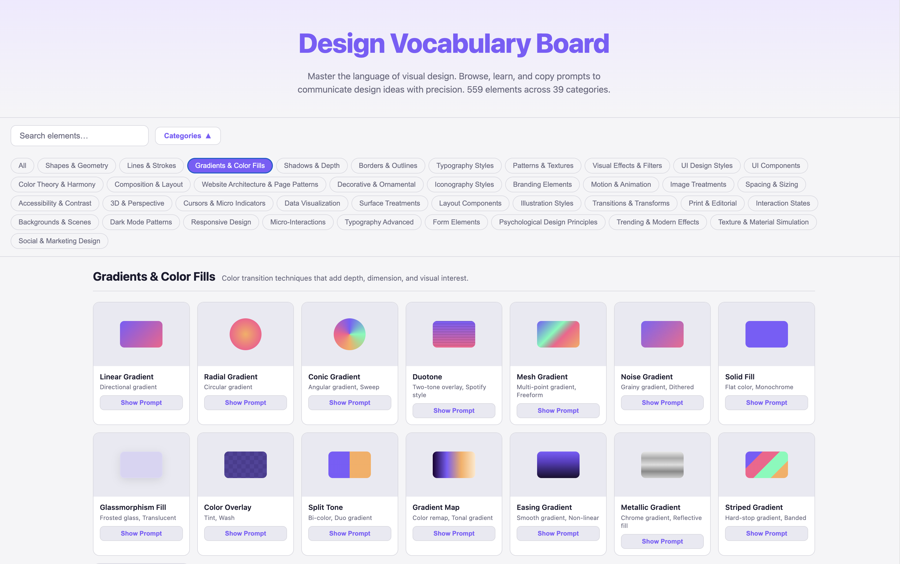
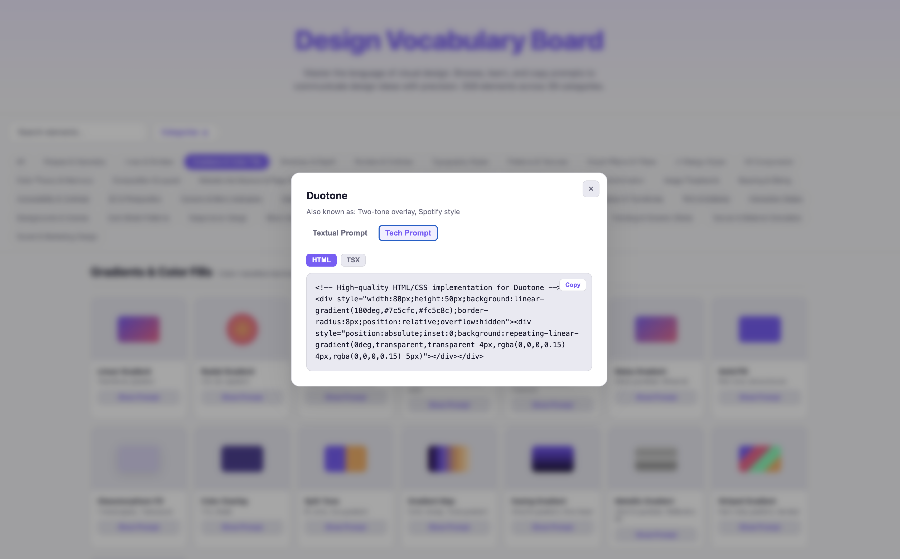

# Design Vocabulary Board

A single-page web app that helps you **browse design terminology**, read short definitions, and **copy prompts** (including textual and technical snippets) so you can describe and implement visual design ideas more precisely. 

## What you get

- **Search** across named design elements  
- **Categories** as filter pills (e.g. gradients, typography, UI patterns)  
- **Cards** with previews, titles, and “Show Prompt” for each element  
- **Detail view** with tabs for prompts and optional **HTML / TSX** style technical snippets you can copy  

## MCP Server

The design board is also available as an **MCP server** so AI agents can programmatically query patterns, retrieve prompts, and use them as context when generating or reviewing code.

### Setup

```bash
cd mcp-server
npm install
npm run build
```

### Running the server

**Streamable HTTP (default)** — starts on port 3001, supports multiple concurrent agents:

```bash
npm start                    # http://localhost:3001/mcp
npm start -- --port=8080     # custom port
```

**stdio** — for local tools like Cursor and Claude Desktop:

```bash
npm run start:stdio
```

### Use with Claude Desktop / Cursor

**Streamable HTTP** (recommended for shared/remote access):

```json
{
  "mcpServers": {
    "design-vocabulary-board": {
      "type": "streamable-http",
      "url": "http://localhost:3001/mcp"
    }
  }
}
```

**stdio** (for local pipe mode):

```json
{
  "mcpServers": {
    "design-vocabulary-board": {
      "command": "node",
      "args": ["/absolute/path/to/desgin_board/mcp-server/dist/index.js", "--transport=stdio"]
    }
  }
}
```

### What's Exposed

| Primitive | Name | Description |
|-----------|------|-------------|
| **Tool** | `list_categories` | List all 39 design pattern categories |
| **Tool** | `search_patterns` | Search patterns by name, alias, or description |
| **Tool** | `get_pattern_prompt` | Get a pattern's prompt in textual, HTML, or TSX format |
| **Tool** | `get_implementation` | Get implementation code with design guidance |
| **Prompt** | `implement_component` | Generate a full implementation prompt for a pattern |
| **Prompt** | `review_against_pattern` | Review code against a canonical pattern |
| **Prompt** | `suggest_design_system` | Suggest patterns for a UI description |
| **Resource** | `designboard://catalog` | Category index with pattern counts |
| **Resource** | `designboard://categories/{slug}` | All patterns in a category |
| **Resource** | `designboard://patterns/{slug}` | Single pattern with all prompts |

### Re-generate pattern data

If you update `index.html` with new patterns, regenerate the MCP data:

```bash
cd mcp-server
npm run extract-data
npm run build
```


## Screenshots

**Browse by category** — pick a topic and scan the grid of elements.



**Prompt detail** — open an element to read aliases and copy textual or tech prompts.




## How to run locally

**Option A — open the file**

Double-click `index.html`, or drag it into a browser window.

**Option B — local server (recommended)**  

Some browsers restrict certain features when pages are opened as `file://`. If anything behaves oddly, serve the folder:

```bash
cd /path/to/desgin_board
python3 -m http.server 8080
```

Then open [http://localhost:8080](http://localhost:8080) — the app loads from `index.html` automatically.

